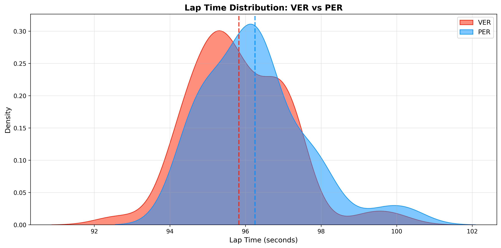
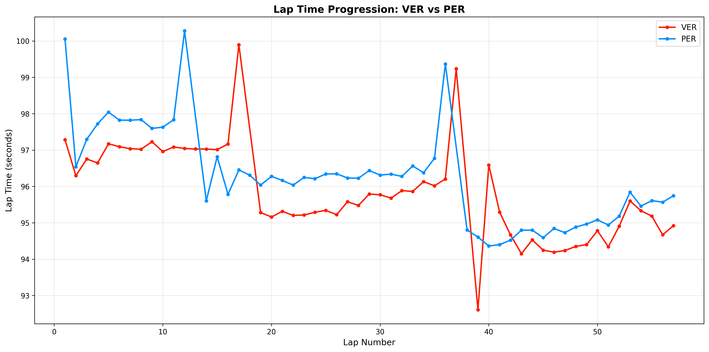

# 🏎️ F1 Driver Performance Analyzer

Python CLI tool for analyzing Formula 1 driver performance metrics including consistency, sector times, tire management, and head-to-head comparisons.

## 📊 Features

- **Individual Driver Analysis**: Consistency scores, sector breakdown, tire management
- **Head-to-Head Comparisons**: Compare two drivers with statistical analysis
- **Visual Analytics**: Lap time distribution and progression charts
- **Race Results Integration**: Automatic race result data

## 🖼️ Example Output

### Lap Time Distribution


### Lap Time Progression


## 🛠️ Technologies

- **Python 3.11**
- **FastF1**: Official F1 data API
- **Pandas**: Data analysis
- **Matplotlib & Seaborn**: Statistical visualizations
- **NumPy**: Numerical computing

## 🚀 Installation
```bash
git clone https://github.com/y-yuchien-c/f1-driver-performance-analyzer.git
cd f1-driver-performance-analyzer

python -m venv venv
source venv/bin/activate  # Windows: venv\Scripts\activate

pip install -r requirements.txt
```

## 💻 Usage

### Analyze Single Driver
```bash
python main.py --driver VER --race Bahrain --year 2024
```

Output includes:
- Consistency analysis (mean, std dev, coefficient of variation)
- Sector-by-sector breakdown
- Tire management across stints
- Race result

### Compare Two Drivers
```bash
python main.py --compare VER PER --race Bahrain --year 2024
```

Generates:
- Statistical comparison table
- Lap time distribution plot (PNG)
- Lap time progression plot (PNG)

### Available Options
```bash
--year YEAR        Season year (default: 2024)
--race RACE        Race name (default: Bahrain)
--driver CODE      Driver code for single analysis
--compare D1 D2    Compare two drivers
```

## 📈 Key Metrics

**Consistency Score**: Coefficient of variation (CV) - lower is better
- CV < 0.015: Excellent consistency
- CV 0.015-0.020: Good consistency  
- CV > 0.020: Inconsistent performance

**Tire Management**: Compares early vs late stint pace to measure degradation

**Sector Analysis**: Identifies strengths/weaknesses across track sections

## 🎯 Example Analysis
```
📊 CONSISTENCY ANALYSIS
  Average Lap Time:    95.751s
  Standard Deviation:  1.174s
  Consistency Score:   0.0123 (lower = better)

🏁 SECTOR ANALYSIS
  SECTOR_1: Best: 29.741s, Avg: 31.408s
  SECTOR_2: Best: 39.916s, Avg: 41.415s
  SECTOR_3: Best: 22.951s, Avg: 23.734s

🛞 TIRE MANAGEMENT
 stint compound  total_laps  pace_dropoff
     1     SOFT          17        0.796s
     2     HARD          19        1.455s
     3     SOFT          19        0.481s
```

## 📁 Project Structure
```
f1-driver-performance-analyzer/
├── src/
│   ├── data_collector.py      # FastF1 API data fetching
│   ├── performance_metrics.py # Statistical analysis
│   └── comparisons.py          # Head-to-head comparisons
├── main.py                     # CLI interface
└── requirements.txt
```

## 🔮 Future Enhancements

- [ ] Season-long performance tracking
- [ ] Qualifying vs race pace analysis
- [ ] Weather impact correlation
- [ ] Interactive web dashboard
- [ ] Export reports to PDF

## 👤 Author

**Elaine (Yi-Yu Chien)**  
University of Chicago '28 | CS & Economics

## 📝 License

MIT License
